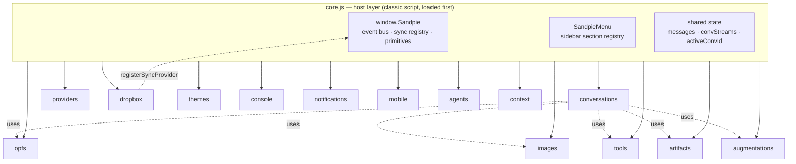
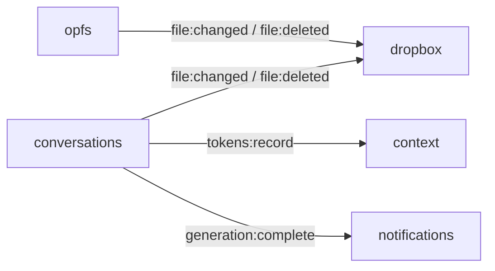

# sandpie — Architecture

Sandpie is a **host + plugins** design. A thin host page owns nothing but a
contract; every feature is an independent module that plugs into that contract.

**Golden rule:** dependencies flow ONE way — **modules depend on the host
(`core.js`); the host never names a specific module.** Optional capabilities plug
in through a registry or the event bus, so any module can be deleted and the page
still boots with core chat working.

---

## 1. Layering



Solid arrows = "depends on the host." Dotted = runtime use of another module's
global, always optional and guarded (`if (typeof X !== 'undefined')`).

---

## 2. The host contract — `window.Sandpie`

Defined in `core.js`. This is the **only** integration surface a module may touch.

| Member | Kind | Backed by | Purpose |
|---|---|---|---|
| `events.on/off/emit` | event bus | core | pub/sub between modules |
| `$(id)` | primitive | core | `document.getElementById` |
| `api(url)` | primitive | core | route an API URL (remote proxy / local `/proxy/` / direct) |
| `addMsg(role,text,host)` | lazy getter | conversations.js | render a message bubble |
| `opfs` | lazy getter | opfs.js | filesystem object |
| `menu` | lazy getter | core (`SandpieMenu`) | sidebar section registry |
| `tokens` | lazy getter | context.js (`SandpieTokens`) | token accounting (or `null`) |
| `opfsMtime(path)` | method | opfs.js | last-modified time |
| `isGenerating()` | method | conversations.js | any stream generating? |
| `openFilePath()` | method | opfs.js | currently-open file |
| `refreshFiles()` | method | opfs.js | re-render file list |
| `refreshConversations()` | method | conversations.js | re-render conversation list |
| `registerSyncProvider(impl)` | registry | core | install the optional cloud-sync capability |
| `syncProvider()` / `sync()` / `fileSyncStatus()` / `initialSyncDone()` | registry | core → provider | no-ops when no provider is registered |

Getters are **lazy** on purpose: `core.js` loads before the modules that back
them, so `Sandpie.opfs`, `Sandpie.addMsg`, etc. resolve at call-time, not when the
contract object is built.

---

## 3. The event bus

`Sandpie.events` is a tiny pub/sub (`on` / `off` / `emit`). It's how modules talk
without referencing each other. Full catalog:

| Event | Payload | Emitted by | Consumed by |
|---|---|---|---|
| `file:changed` | `path` (string) | conversations.js (save / update / duplicate), opfs.js (write / upload) | dropbox.js (sync engine) |
| `file:deleted` | `path` (string) | conversations.js (delete), opfs.js (delete) | dropbox.js |
| `tokens:record` | `{ convId, usage }` | conversations.js (on a usage event) | context.js (`SandpieTokens`) |
| `generation:complete` | `{ convId, aborted }` | conversations.js (round `finally`) | notifications.js (system toast) |
| `sync:provider-changed` | provider \| `null` | core.js (`registerSyncProvider`) | internal |



Adding an event = pick a `namespace:verb` name, `emit` it, document the row above.
No central registration needed.

---

## 4. Registries (optional capabilities)

- **Sync provider** — `dropbox.js` calls `Sandpie.registerSyncProvider({ sync(),
  fileStatus(path, opfsMtime), getState(), isConnected(), initialSyncDone })`.
  With no provider registered, `Sandpie.sync()` / `fileSyncStatus()` are no-ops and
  the file browser shows a local-only view. This is the reference pattern for any
  "the host pulls a value/behaviour from a module" capability.

---

## 5. Sidebar — `SandpieMenu`

`SandpieMenu` (in core.js) is a registry of collapsible sidebar sections. Modules
call `SandpieMenu.add(id, { title, open, dot, badge, html, onRender })`; the
section is inserted above the footer. Status dots (`config.dot`) are toggled by
each module directly via `document.getElementById(dotId).classList`.

| Section id | Owned by | Registration |
|---|---|---|
| `convSection` | host HTML | static markup |
| `filesSection` | host HTML | static markup |
| `aiSection` | providers.js | `SandpieMenu.add` |
| `agentsSection` | agents.js | `SandpieMenu.add` |
| `contextSection` | context.js | `SandpieMenu.add` |
| `artifactsSection` | artifacts.js | `SandpieMenu.add` |
| `themeSection` | themes.js | `SandpieMenu.add` |
| `console` | console.js | `SandpieMenu.add` |
| `cloudSection` | dropbox.js | `SandpieMenu.add` |
| `notificationsSection` | notifications.js | `SandpieMenu.add` |

---

## 6. Shared state

`messages`, `convStreams`, `convLastViewed`, `activeConvId` are declared in
`core.js` as **host globals** (not on `Sandpie`). They stay global because several
modules (conversations, artifacts, context, augmentations, mobile) read them as
bare globals, and conversations.js *reassigns* `activeConvId` / `messages`. A
module-scoped binding couldn't be shared that way without fragile syncing.

---

## 7. Load order & timing

The host page is pure markup; **all** logic loads via `<script>` tags. Order and
script type are load-bearing:

```
<head>
  marked, DOMPurify           (CDN)
  core.js                     (classic)   ← FIRST: defines $, SandpieMenu, Sandpie, state
  themes.js                   (classic)
  providers.js                (module)
  console.js, dropbox.js, images.js, notifications.js, tools.js, opfs.js  (classic)
  mobile.js, conversations.js (module)
<body>
  ...markup...
  agents.js, context.js, artifacts.js     (module)
  augmentations.js            (classic, defer)
```

Execution timeline:
1. **Classic head scripts** run during head parse, in order: `core → themes →
   console → dropbox → images → notifications → tools → opfs`.
2. **`type=module` scripts are deferred** — they run after the document is parsed,
   in document order (`providers → mobile → conversations → agents → context →
   artifacts`), before `DOMContentLoaded`.
3. Most modules do their real init on **`DOMContentLoaded`** (register their
   section, wire DOM).

Rules that fall out of this:
- **`core.js` MUST be a classic script loaded first.** A `type=module` would scope
  `$` / `Sandpie` / `SandpieMenu` / state to the module; they must be *bare
  globals* every other script reads by name. Loading first is safe because no
  module touches `Sandpie`/`SandpieMenu` at eval-time — only inside init/DCL/runtime
  functions — and the contract's own refs are lazy getters.
- **conversations.js boots on `DOMContentLoaded`, not at module-eval.** Restoring
  the last open chat can call `renderArtifact` (artifacts.js), which loads *after*
  conversations.js; waiting for DCL guarantees it exists.
- Anything that touches body DOM from a head/classic module must defer to DCL
  (e.g. opfs.js wires the file browser in `initFileBrowser` on DCL).

---

## 8. How to add a module

1. Create `modules/yourthing.js`.
2. Add a tag to **`sandpie-test.html`** (then sync to `sandpie.html`):
   `<script src="modules/yourthing.js"></script>` (classic) or add
   `type="module"` if you need ES-module semantics. Place it after `core.js`.
3. Talk to the rest of the app **only through `Sandpie`** — `Sandpie.events` to
   emit/listen, `Sandpie.opfs` for files, `Sandpie.$`, etc. Never reference another
   module's internals; reach optional features through their global (guarded) or an
   event.
4. Add a sidebar section if you have UI:
   `SandpieMenu.add('yourSection', { title:'Your Thing', html, onRender })`.
   Defer init to `DOMContentLoaded` and guard:
   `if (typeof SandpieMenu === 'undefined') { setTimeout(init, 50); return; }`.
5. Providing an *optional capability* others consume? Expose it via a registry
   (like `registerSyncProvider`) or events — never a hard import.
6. **Acceptance test:** comment out your `<script>` tag — the page must still boot
   with zero console errors (graceful degradation is the whole point).
7. Document it: copy `docs/modules/_TEMPLATE.md` to `docs/modules/yourthing.md`,
   and add its event rows to the catalog (§3) and its section to §5.
